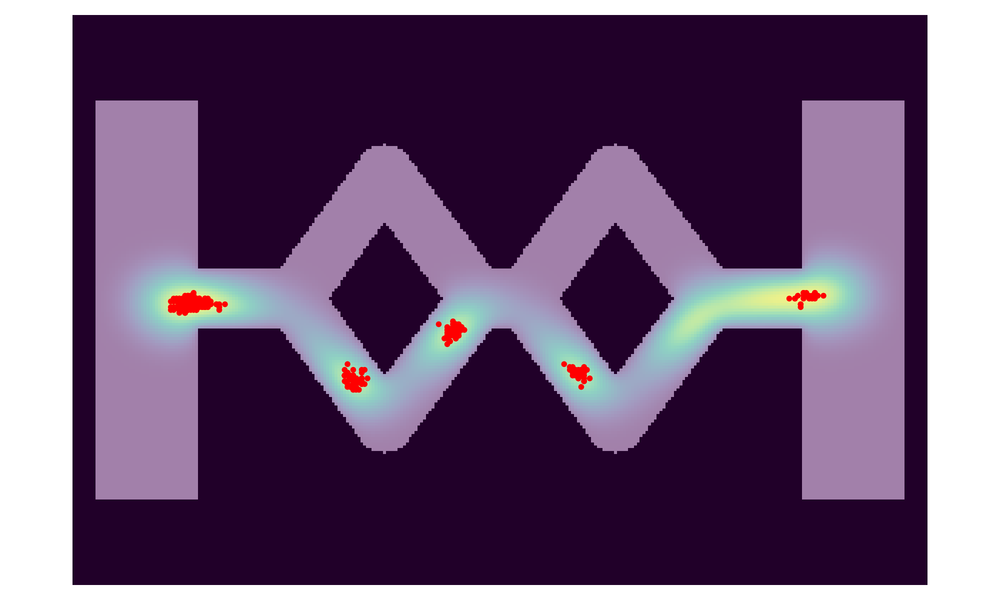
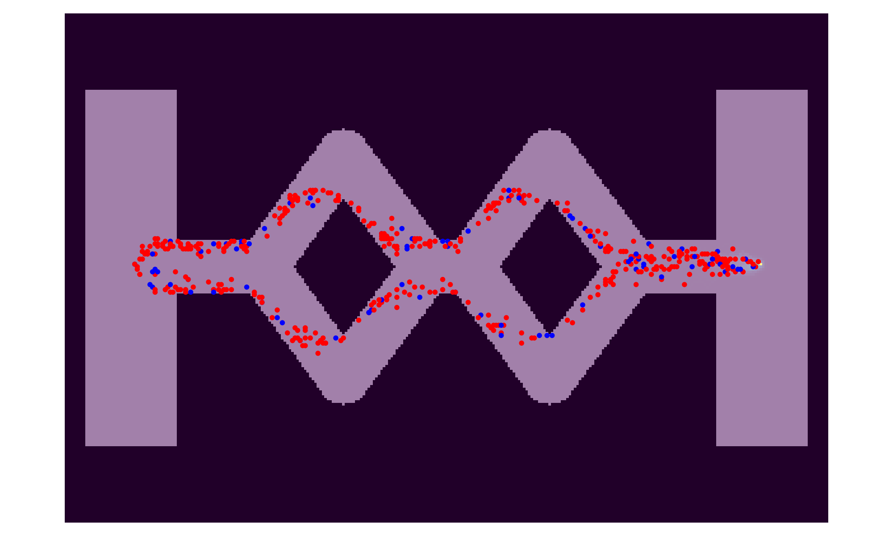
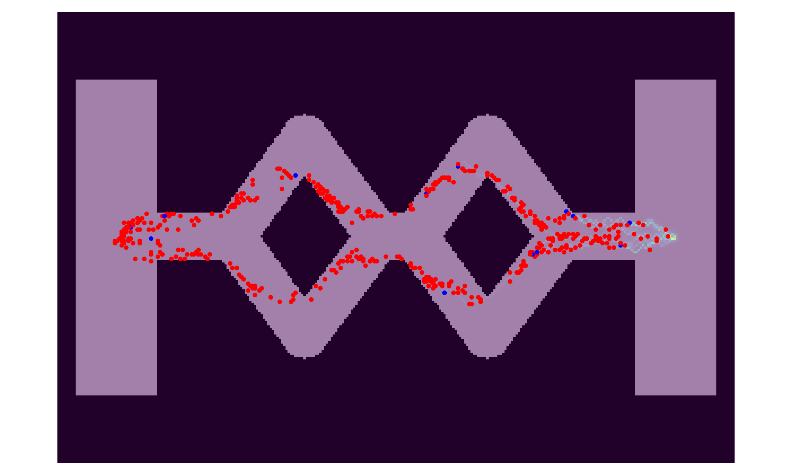
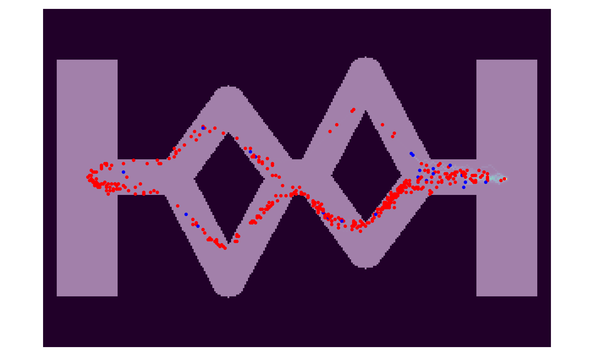
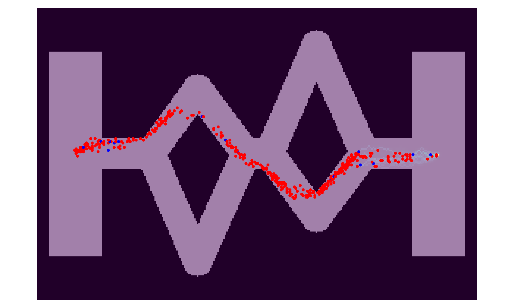
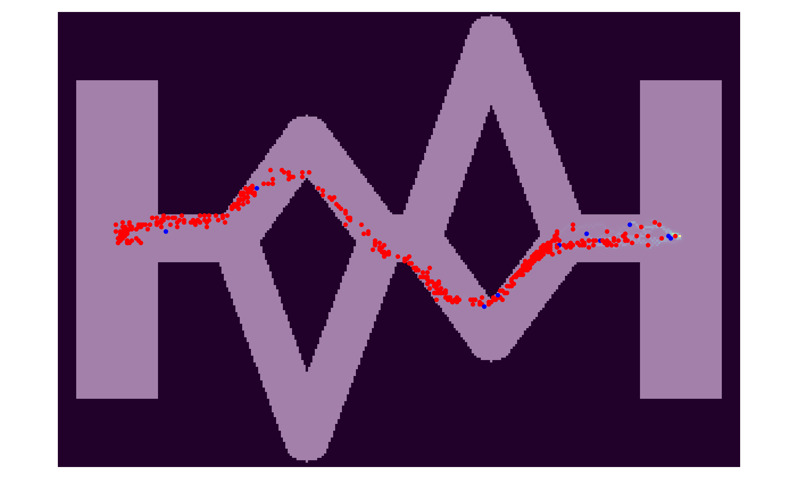

# Wnioski

Niestety nie udało się uzyskać stabilnej kalibracji parametrów która dawałaby wybór jednej trasy w scenariuszu z `r = 1.0`. Przy nierównych trasach
mrówki wydają się faktycznie optymalizować wybór trasy i wybierają krótszą trasę, efekt ten jest tym większy im większa dysproporcja długości trasy.

Przetestowałem szeroki zakres parametrów modelu:

- `A`: [3, 5.8, 6, 10],
- `sigma`: [10, 15, 20, 25, 48, 50],
- `evaporation_rate`: [0.001, 0.005, 0.01, 0.02],
- `diffusion_rate`: 20 wartości z zakresu [0.005, 0.02] + wiele innych dobranych ręcznie

Główny problem polegał na tym, że przy zbyt mało agresywnym rozprzestrzenianiu fermonu, mrówki dzieliły się na dwie trasy, a przy zbyt agresywnym rozprzestrzenianiu, mrówki gromadziły się w pojawiajacych się maksimach feromonu i utykały w nich.

<table>
    <tr>
        <td></td>
        <td></td>
    </tr>
</table>

Najlepsze okazały się takie parametry - przynajmniej najstabilniejsze:

```py
AntsScenario(
    n=500,
    width=300,
    height=200,
    epsilon=0.1,
    A=3.0,
    sigma=40.0,
    evaporation_rate=0.02,
    diffusion_rate=0.012,
    max_feromone=float("inf"),
    rng=31,
)
```

Niestety odkryłem też dużą zależność stabilności od seedu generatora liczb losowych, co sugeruje, że model jest bardzo niestabilny i wrażliwy na drobne zmiany.


## Przykładowe wyniki

Poniższe obrazki prezentują ustabilizowane trasy mrówek. Mrówki czerwone to mrówki w fazie ***SEARCH***, a niebieskie ***RETURN***. W lewym pokoju
znajduje się punktowe gniazdo, a w prawym źródło pożywnienia.

<table>
    <tr>
        <th>r = 1.0</th>
        <th>r = 1.4</th>
    </tr>
    <tr>
        <td></td>
        <td></td>
    </tr>
    <tr>
        <th>r = 1.7</th>
        <th>r = 2.0</th>
    </tr>  
    </tr>
        <td></td>
        <td></td>
    </tr>
</table>

Ciekawy przypadek to `r = 1.4` gdzie widać, że początkowo mrówki wybierają teoretycznie dłuższą trasę, ale możliwe, że jest to 
efekt tego, że mrówki wybrały sobie iście trochę niżej korytarzem przy gnieździe, i pójście w taki sposób było tak naprawdę
krótsze. W drugim rozgałęzioniu wybrały już krótszą trasę. 

Przy `r = 1.7` i `r = 2.0` widać, że mrówki wybierają krótszą trasę.
