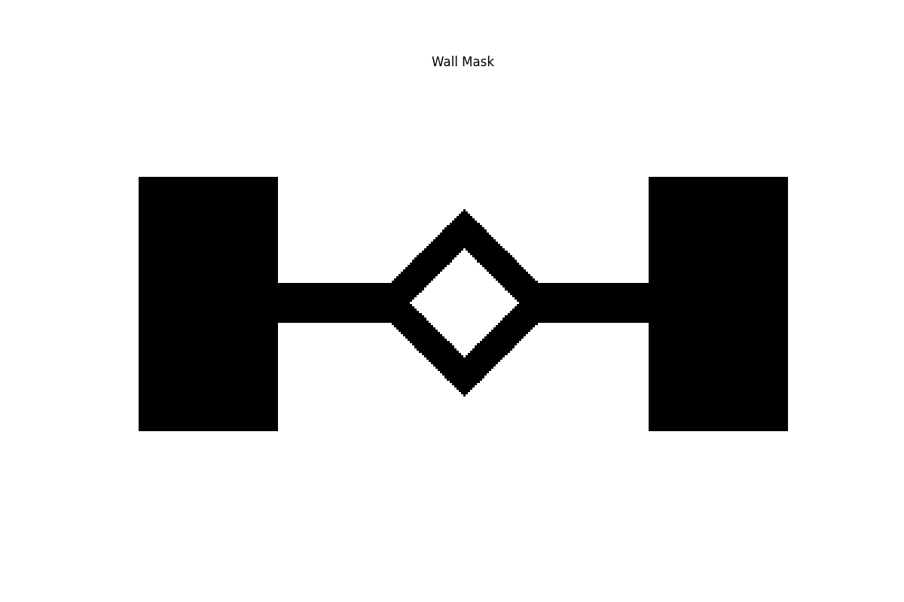
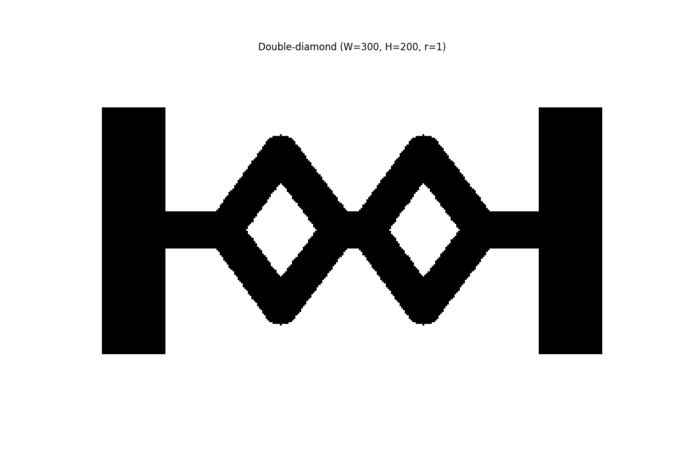
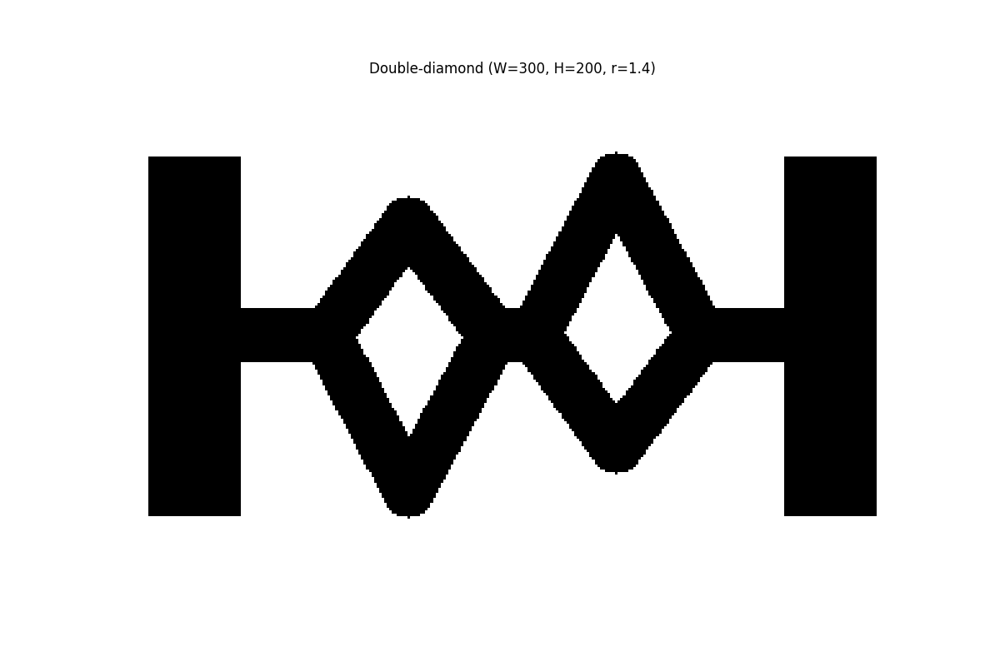
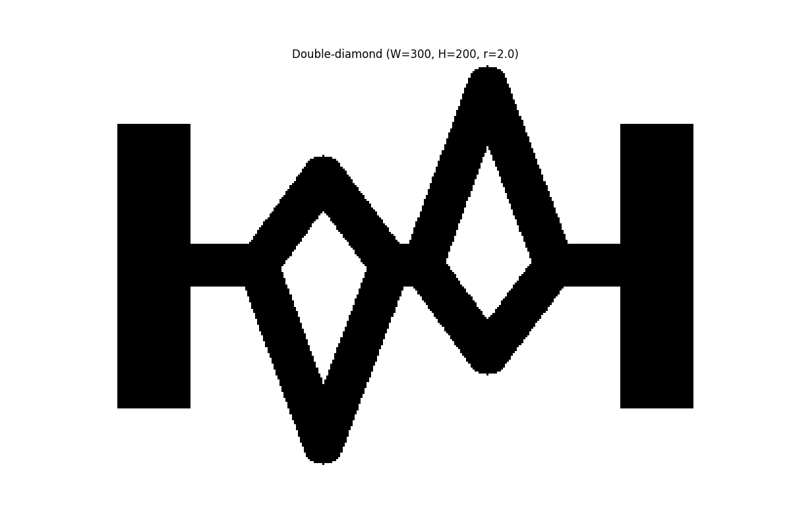

# Scenrariusze testowe

Trasy jak z artykułów [1](#1) i [2](#2) zostały wygenerowane przy pomocy narzędzi z parametrycznym współzynnikiem `r`. 
Wartość `r = 1.0` oznacza, że obie trasy są identyczne. Współczynnik `r = 1.4` oznacza, że trasa dłuższa jest 1.4 razy 
dłuższa od trasy krótszej. Przykładowe trasy:

<table>
    <tr>
        <td></td>
        <td></td>
    <tr>
    </tr>
        <td></td>
        <td></td>
    </tr>
</table>

# Bibliografia
<a id="1">[1]</a>
Deneubourg, J.L., Aron, S., Goss, S. et al. The self-organizing exploratory pattern of the argentine ant. J Insect Behav 3, 159–168 (1990). https://doi.org/10.1007/BF01417909

<a id="2">[2]</a> 
Goss, S., Aron, S., Deneubourg, J.L. et al. Self-organized shortcuts in the Argentine ant. Naturwissenschaften 76, 579–581 (1989). https://doi.org/10.1007/BF00462870s
